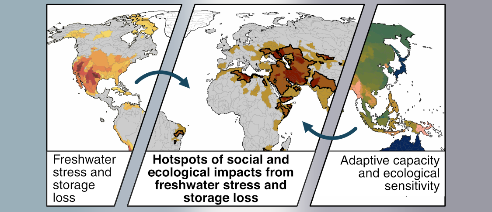

# Hotspots of social and ecological impacts from freshwater stress and storage loss

*Manuscript currently in revision at Nature Communications.*  
Author list: X. Huggins, T. Gleeson, M. Kummu, S.C. Zipper, Y. Wada. T.J. Troy, J.S. Famiglietti  

## Repository structure
* **R/** -- 
    * **setup/** -- imports necessary packages and sets common plotting arguments
    * **preprocessing/** -- data preparation scripts 
    * **udfs/** -- user defined functions
    * **analysis/** -- core scripts that perform analysis and generate all maps and figures
* **assets/** -- holds images used as the banner above and in the interactive subjectivity results web-page
* **docs/** -- contains files for the associated web-page providing interactive subjectivity result @ [this link](https://xanderhuggins.github.io/Hotspots/)